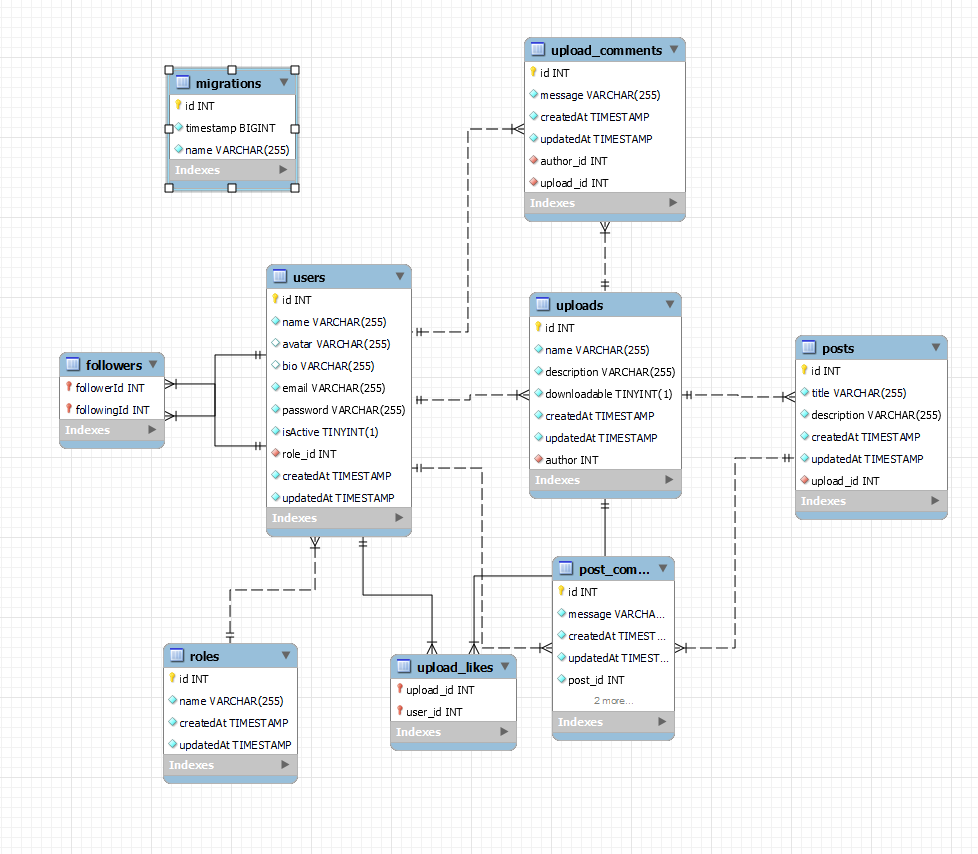

# Checkpoint's Network📢


<details>
  <summary>Content 📝</summary>
  <ol>
    <li><a href="#objective">Objective</a></li>
    <li><a href="#about-the-project">About the project</a></li>
    <li><a href="#stack">Technologies used</a></li>
    <li><a href="#diagram-bd">Diagram</a></li>
    <li><a href="#Local-installation">Installation</a></li>
    <li><a href="#endpoints">Endpoints</a></li>
    <li><a href="#contribuciones">Contribuciones</a></li>
    <li><a href="#contacto">Contacto</a></li>
  </ol>
</details>

## Objective 🎯
My objective for this project was to create a functional API connected to a database with some relations @ManyToOne and @ManyToMany and at the same time create a frontend for this project in [This Repository](https://github.com/JesusMatinezClavel/Checkpoint-FrontEnd-GH-Final_Assignment.git).

## About the project📑
This aplication has been created as the finnal assignment for the GeeksHub's FullStackDeveloper bootcamp with the objective of developing the structure needed for the backend of a Social Network centered in sharing 3D models. This API allows anyone to check for some of the models uploaded by the users and register in it to have your own profile, aside from creating or deleting uploads and creating comments in all of the models. It also allows the user with Super_admin role to delete or call users.  

## Technologies used 💻
<div align="center">
<a href="https://www.expressjs.com/">
    
</a>
<a href="https://nextjs.org/">
    
</a>
<a href="https://typeorm.io/">
    
</a>
<a href="https://www.typescriptlang.org/">
    
</a>
<a href="https://www.npmjs.com/package/multer">
    
</a>
<a href="https://nodejs.org/api/fs.html">
    
</a>
<a href="https://nodejs.org/api/path.html">
    
</a>
<a href="https://jwt.io/">
    
</a>
<a href="https://www.npmjs.com/package/cors">
    
</a>
<a href="https://www.npmjs.com/package/dotenv">
    
</a>
<a href="https://www.npmjs.com/package/bcrypt">
    
</a>
<a href="https://git-scm.com/">
    
</a>
<a href="https://www.github.com/">
    
</a>
 </div>

## DB Diagram📉


## Local installation🔨
1. Clone the repository:

    `$ git clone https://github.com/JesusMatinezClavel/Checkpoint-Network_BackEnd-GH-Final_Assignment.git`

2. Install the dependencies

    ` $ npm install `

3. Create the file `.env` from `.env.sample` and change the values to your needs:

    Port where the server will be:

        PORT= 

    Credentials for the database:

        DB_host= 
        DB_port= 
        DB_username= 
        DB_password= 
        DB_database= 

    Token's secret:

        JWT_secret=

4. Conect our repository with the database

    `$ npm run dev`

5. Execute the migrations

    ` $ npm run run-migrations ` 

6. Execute the seeders

    ` $ npm run seed-db`


## Endpoints🚩
<details>
<summary>Endpoints</summary>

- AUTH
    - REGISTER

            POST localhost:4000/api/auth/register
        body:
        ``` js
            {
            "name": "",
            "avatar": "",
            "email": "",
            "password": ""
            }
        ```

    - LOGIN

            POST localhost:4000/api/auth/login 
        body:
        ``` js
            {
            "email": "",
            "password": ""
            }
        ```
    - LOGOUT

            POST localhost:4000/api/auth/logout


- SUPERADMIN
    - Get All Users

            GET localhost:4000/api/user/superadmin

    - Delete User

            localhost:4000/api/user/superadmin/:id

- USERS
    - Get Own Profile

            GET localhost:4000/api/user/profile

    - Get Profile By Id

            GET localhost:4000/api/user/profile/:id

    - Update Own Profile

            PUT localhost:4000/api/user/profile/update
            
        body:
        ``` js
            {
            "name": "",
            "bio": "",
            "email": "",
            "avatar":"",
            "password": "",
            "confirmPassword": ""
            }
        ```        
    - Delete Own Profile

            DELETE localhost:4000/api/user/delete/

    - Like/Dislike Model

            PUT localhost:4000/api/user/like/:id

    - Follow/Unfollow User

            PUT localhost:4000/api/user/follow/:id

- UPLOADS
    - New Upload

            POST localhost:4000/api/upload/upload
        body:
        ``` js
            {
            "name": "",
            "description": "",
            "downloadable": false
            }
        ```
    - Get Uploads

            GET localhost:4000/api/upload/all?page

    - Get File by ID

            GET localhost:4000/api/file/download/:id

    - Delete Upload

            DELETE localhost:4000/api/upload/delete/:id

- UPLOAD COMMENTS

    - Get My Upload Comments

            GET localhost:4000/api/comment/upload/own

    - Create New Upload Comment

            POST localhost:4000/api/comment/upload/new/:id            
        body:
        ``` js
            {
            "message":""
            }
        ```

    - Update Upload Comment

            PUT localhost:4000/api/comment/upload/update/:id
        body:
        ``` js
            {
            "message": ""
            }
        ```

    - Delete Upload Comment

            DELETE localhost:4000/api/comment/upload/delete/:id

</details>

## Contributions🤘
Sugestions are always welcomed!

You can do it both ways:

1. Create an issue
2. Create a fork of the repository
    - Create new branch
        ```
        $ git checkout -b feature/nombreUsuario-mejora
        ```
    - Commit the changes
        ```
        $ git commit -m 'feat: mejora X cosa'
        ```
    - Push the branch
        ```
        $ git push origin feature/nombreUsuario-mejora
        ```
    - Open a Pull Request

## Contact📧
<a href = "mailto:jmcvalles@gmail.com"></a>
<a href="https://www.linkedin.com/in/jes%C3%BAs-mart%C3%ADnez-clavel-vall%C3%A9s-913294108?lipi=urn%3Ali%3Apage%3Ad_flagship3_profile_view_base_contact_details%3BtQmk%2FVrTShiKcofYcK6uYg%3D%3D" target="_blank"></a> 
</p>

